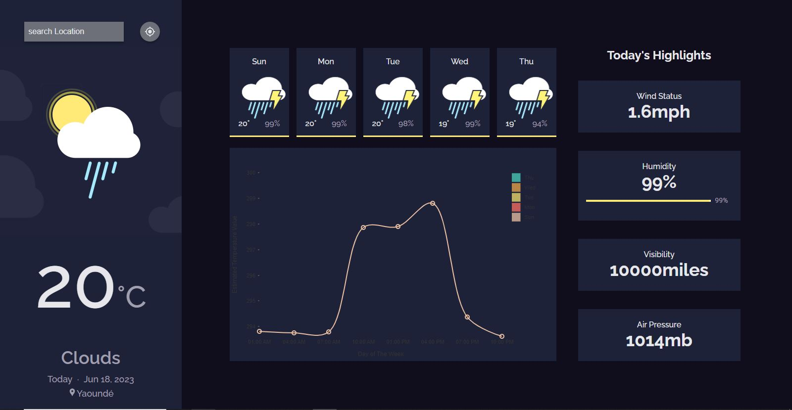

# Minimal Weather App

A sample weather app built with React Js and  application  state is managed using the Context API

This project was bootstrapped with [Create React App](https://github.com/facebook/create-react-app).
It's a sample weather app built using [ReactJs](https://reactjs.org/) with weather data gotten from [Open Weather Data App](https://openweathermap.org/). The app uses Google Maps to search and display the location for which the weather was searched 

#### Run the following command to start the project

## `npm run start`

## Project Preview

## Project Setup

In order to setup and run this project locally, you should follow these steps

- Clone the repository to your local environment
- copy the `env.example` file and rename it to `env.local`
- Add your weather app API key and set is as the value for the `REACT_APP_API_KEY` property
- The run the following commands
  1. `npm install`
  1. `npm start`

## Available Scripts

In the project directory, you can run:

### `npm start`

Runs the app in the development mode.\
Open [http://localhost:3000](http://localhost:3000) to view it in the browser.
